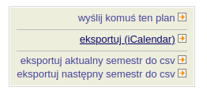

# USOS iCal fixer

## Co to robi?

Zamienia pełny adres w wydarzedniu na numer budynku i sali pobrany z opisu

## Jak używać?

### Otwórz swój [plan zajęć](https://web.usos.agh.edu.pl/kontroler.php?_action=home/plan) w systemie USOS

### Kliknij "eksportuj (iCalendar)" w prawym górnym rogu

### Skopiuj link z pierwszego akapitu: kliknij prawym na fragment "tego odnośnika" i wybierz "Kopiuj link"

### Wklej link w nowej karcie/oknie lub w swojej aplikacji kalendarza i poprzedź go adresem `https://tools.sokoloowski.pl/usos-ical-fixer/`

